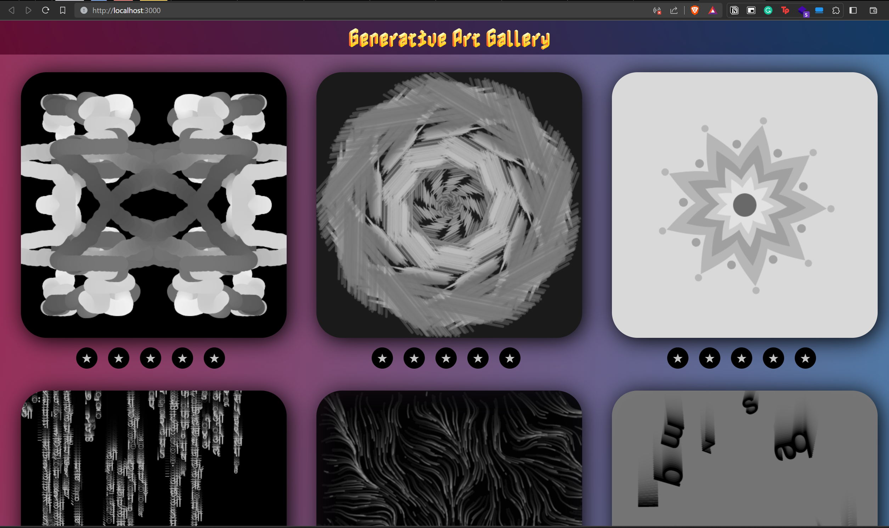

# Mid Term Project - GAG - Generative Art Gallery

====================

## Project Description
The project showcases different generative artwork made with P5.js. It uses React.js to create a gallery of the different artworks. 

Here is the screenshot and a demo of the project:

https://github.com/harshpalan/DynamicWebClass/assets/10105238/dae6f525-e2cb-4138-a16e-5952a4073f4e

